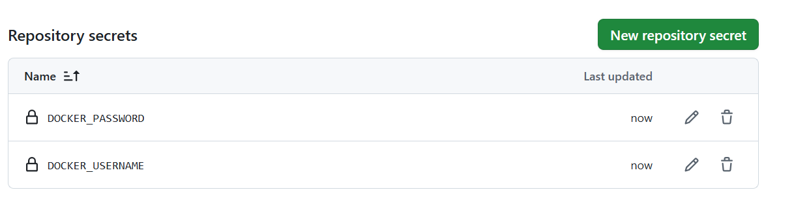
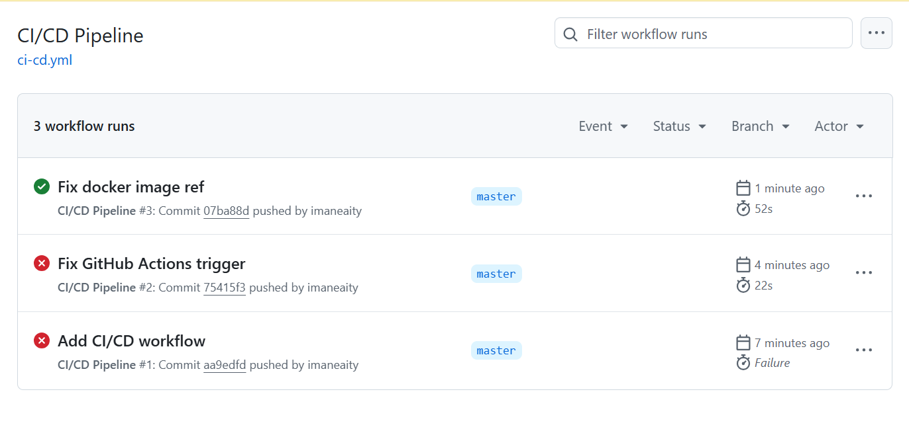

# Part 3 – CI/CD Pipeline

This section describes the CI/CD pipeline created to automate building, securing, and deploying the `link-extractor` Docker image.

## Goal

Automate the following:
1. Build the Docker image for the project.
2. Scan it for vulnerabilities using Trivy.
3. Push the image to DockerHub.
4. Trigger the process on every push to the `master` branch.

## Tool Used

- **GitHub Actions** – For automation
- **DockerHub** – To store the Docker image
- **Trivy** – To scan the Docker image for vulnerabilities

## Project Structure

```
.github/
└── workflows/
    └── ci-cd.yml
```

## Secrets Configuration

The following secrets were added to the GitHub repository:

| Secret Name       | Description                  |
|-------------------|------------------------------|
| DOCKER_USERNAME   | Your DockerHub username      |
| DOCKER_PASSWORD   | Your DockerHub password/token|



## Workflow Execution

The GitHub Actions pipeline is triggered automatically on every push to the `master` branch. It builds and pushes the Docker image and then performs a vulnerability scan.



## Outcome

- The Docker image is built and published to DockerHub successfully.
- Trivy runs automatically on the image and reports any vulnerabilities.
- Everything is automated, secure, and version-controlled.

