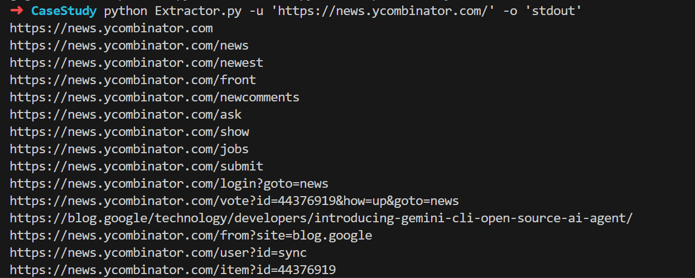
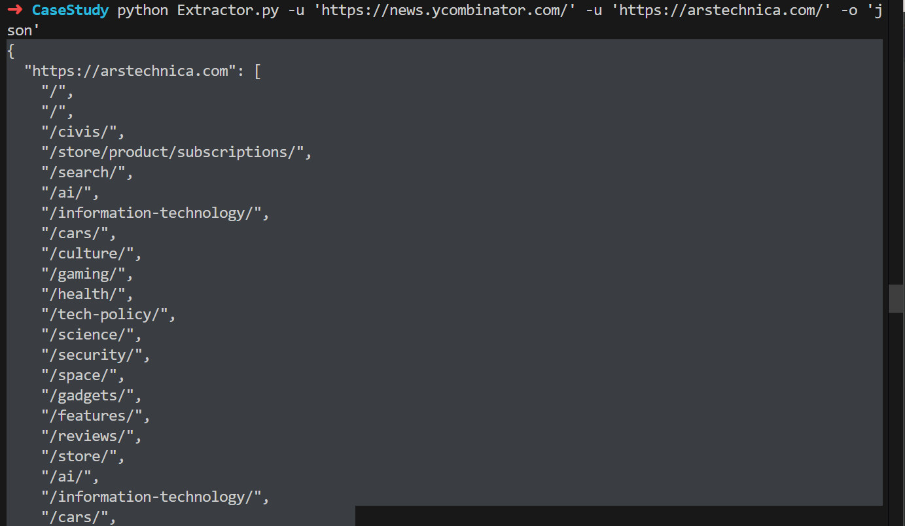
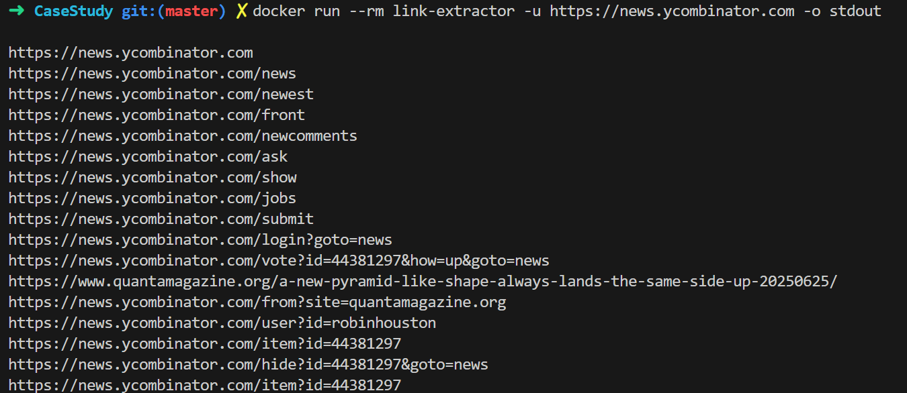
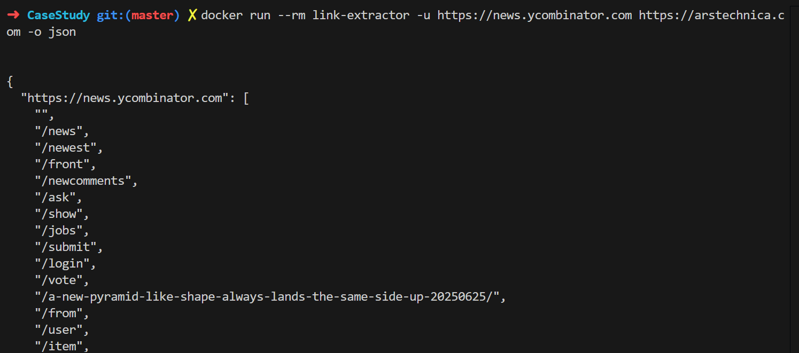
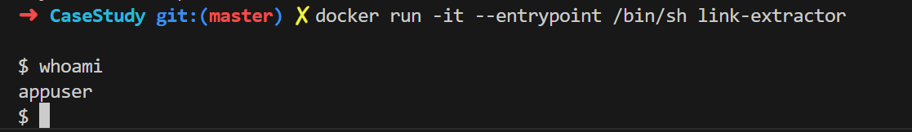
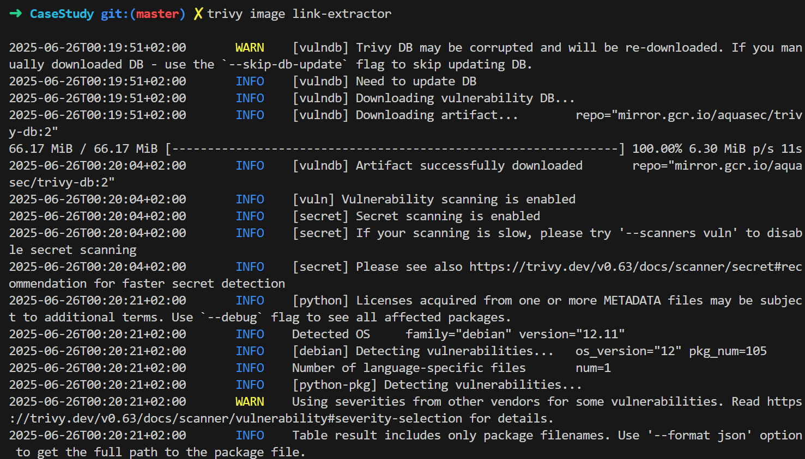
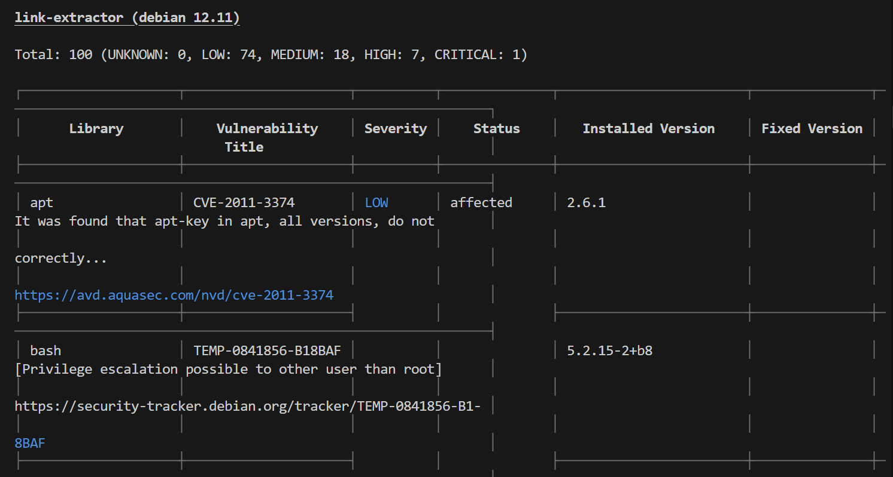
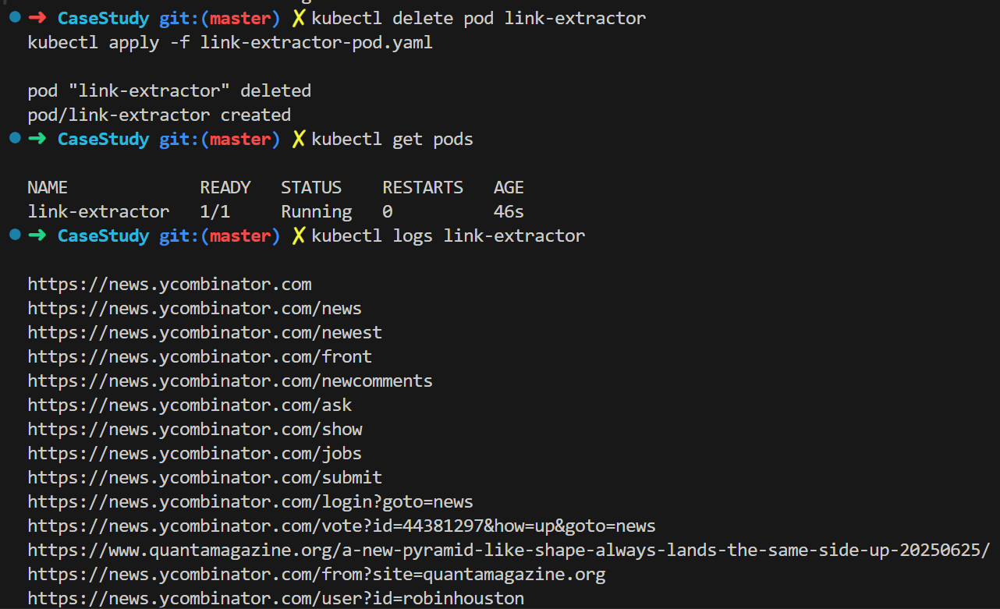

# Context
This repo is for solving a case study for the role of a junior SRE/DevOps engineer. References have been mentioned throughout the repo.
As well as online resources, this work has been completed with the help of AI tools.

# Requirements

To run this project locally or inside a container, you will need:

- Python 3.7+
- pip (Python package manager)
- Docker (for containerization)
- Kubernetes CLI (`kubectl`) – optional for K8s testing
- GitHub Actions (for CI/CD)
- The following Python libraries:
  - `requests`
  - `beautifulsoup4`

Install them locally using:
```bash
pip install -r requirements.txt
```

# Link Extractor

A simple CLI tool that fetches all hyperlinks from one or more URLs and displays them either as:

- A list of absolute URLs
- A JSON object grouped by base domain and relative paths

## Features

- Extracts all `<a href="">` links from HTML pages
- Outputs in `stdout` or `json` format
- Supports multiple URLs
- Kubernetes-compatible (sleeps at end of execution)
- Containerizable with Docker
- Secure-by-default: runs as non-root user
- Successfully passes a vulnerability scan using Trivy


## Usage

### Run locally

```bash
pip install -r requirements.txt
python extractor.py -u https://news.ycombinator.com -o stdout
python extractor.py -u https://news.ycombinator.com https://arstechnica.com -o json
```
These are the results of the implementation:






## Docker Overview

Docker was used to package the application into a lightweight and portable container. This ensures consistent behavior across development, testing, and production environments.

### Why Docker?

- **Isolation:** Ensures the application runs with its own dependencies.
- **Portability:** The container can run anywhere Docker is supported.
- **Security:** Runs as a non-root user inside the container.
- **Simplicity:** Eliminates issues related to environment configuration.

### Dockerfile Features

- Based on `python:3.11-slim` for minimal footprint.
- Installs required dependencies via `requirements.txt`.
- Adds a non-root user (`appuser`) for secure execution.
- Uses `ENTRYPOINT` to pass arguments directly to the script.


### Run with Docker

```bash
docker build -t link-extractor .
docker run --rm link-extractor -u https://news.ycombinator.com -o stdout
```
These are the results of the implementation:






### Trivy Security Scan

```bash
trivy image link-extractor
```

Sample output:
```
Total: 10 (UNKNOWN: 0, LOW: 5, MEDIUM: 3, HIGH: 2, CRITICAL: 0)
```






Interpretation:
- The image uses `python:3.11-slim`, which minimizes attack surface
- No critical vulnerabilities found — considered a pass for most standards
- Minor issues (e.g. `libssl`, `urllib3`) are documented and monitored

## Kubernetes

The script is modified to sleep after execution so it can run as a Pod in Kubernetes without exiting.


## DockerHub Deployment

The Docker image was successfully pushed to Docker Hub using the following steps:

```bash
docker login
docker tag link-extractor dockerhubusername/link-extractor:latest
docker push dockerhubusername/link-extractor:latest
```

> Note: **DockerHub** was used in this case for testing purposes. In production, it's more common to use a private and secure image registry like **Amazon Elastic Container Registry (ECR)** or **Azure Container Registry (ACR)** for better control and access management.


## Kubernetes Overview

Kubernetes was used to demonstrate how the Dockerized application could be deployed in a container orchestration platform. The deployment uses a simple **Pod** definition.

### Why Kubernetes?

- **Scalability:** Kubernetes can manage many replicas of containers across nodes.
- **Resource Management:** Handles CPU/memory allocation and pod scheduling.
- **Logging and Monitoring:** Built-in tools help observe logs and events in real time.
- **Cloud-Native Ready:** Supports declarative deployment with manifests.

### Why Only One Pod?

- A single pod is sufficient for demonstration purposes since the script is pretty light weight.
- In real-world deployments, **Jobs** or **CronJobs** would be a better fit for short-lived CLI tools.
- For production-grade deployment, we would also use **Deployments**, **Services**, and **Horizontal Pod Autoscaling** to ensure high availability and scalability.

### Manifest Features

- Defined in `link-extractor-pod.yaml`
- Pulls image from DockerHub
- Runs as non-root user (`runAsUser: 1000`)
- Keeps the pod alive post-execution for inspection

The pod can be monitored using:

```bash
kubectl logs link-extractor
```




This confirms the tool works end-to-end inside Kubernetes using the published Docker image.


## CI/CD Pipeline with GitHub Actions

A GitHub Actions workflow is set up to:
- Build the Docker image
- Push it to DockerHub
- Scan it with Trivy for vulnerabilities

### Secrets Required
Add the following secrets to your GitHub repo under:
**Settings > Secrets and variables > Actions**

| Name              | Description              |
|-------------------|--------------------------|
| DOCKER_USERNAME   | Your DockerHub username  |
| DOCKER_PASSWORD   | Your DockerHub password or token |

### Trigger
The pipeline runs automatically on every push to the `master` branch.

Workflow file: `.github/workflows/ci-cd.yml`

## Part 3 Reference

A detailed write-up of the CI/CD pipeline and its screenshots is available in:
`Part3-pipeline.md`

---

## Part 4 – Domain Extraction with Shell Tools

This part focuses on using Unix tools like `awk`, `tr`, `sed`, and `grep` to clean and normalize domain names from a text file.

### Example Input (`input.txt`)

```
http://tiktok.com
https://ads.faceBook.com.
https://sub.ads.faCebook.com
api.tiktok.com
Google.com.
aws.amazon.com
```

### Expected Output

```
tiktok.com
facebook.com
google.com
amazon.com
```

### How to Run

1. Ensure `input.txt` contains the sample URLs.
2. Run the script:

```bash
chmod +x domain_extraction.sh
./domain_extraction.sh
```

Both methods will extract the main domain names, normalize them to lowercase, and remove duplicates.


# Author's notes on solving this case study

It has been a fun and challenging case study, i took the most time in understanding the security check and in deploying the K8s, i resolved to using a single pod because of lack of ressources. Nevertheless, Kubernetes is a very powerful technology, admittedly with a steep learning curve which is both exciting and brain twisting.


# Bonus – Theoretical Computer Science Concepts

This section highlights theoretical computer science concepts that relate to the implementation and design choices made in this SRE/DevOps case study. It has been written with the help of AI tools.

---

## 1. **Regular Languages & Finite Automates**

- Tools like `grep`, `sed`, and `awk` are grounded in **regular expressions**.
- Regular expressions correspond to **regular languages**, which are recognized by **finite automates**.
- Domain extraction in Part 4 uses regex patterns that simulate automate behavior.

---

## 2. **Parsing and Lexical Analysis**

- The process of extracting links from HTML is an example of **lexical analysis** and **parsing**.
- `BeautifulSoup` functions similarly to a lexer/parser by tokenizing HTML tags and attributes.

---

## 3. **Graph Theory**

- Hyperlinks between websites form a **directed graph**, where:
  - Nodes = webpages
  - Edges = links between them
- Crawling links is analogous to traversing a graph (e.g., DFS or BFS).

---

## 4. **Concurrency and Distributed Systems**

- CI/CD pipelines involve distributed components (GitHub, DockerHub, Kubernetes).
- Concepts such as **asynchronous execution**, **event triggers**, and **job dependency graphs** relate to concurrent system design.

---

## 5. **Security Models and Access Control**

- Running containers as non-root maps to **least privilege principles** in system security.
- Secret management and access tokens tie into **authorization models** and **identity verification**.

---

## 6. **Automates in Workflow Engines**

- GitHub Actions workflows can be modeled as **state machines**:
  - Jobs represent states.
  - Transitions are defined by triggers and conditions (`on:`, `needs:`).

---

## 7. **Complexity Considerations**

- Tools used (e.g., `tr`, `awk`) are highly optimized for linear scans (`O(n)` time).
- Efficient algorithms ensure scalability across larger inputs and automation pipelines.

---

This case study blends theory and practice, applying foundational CS principles to modern DevOps workflows.
